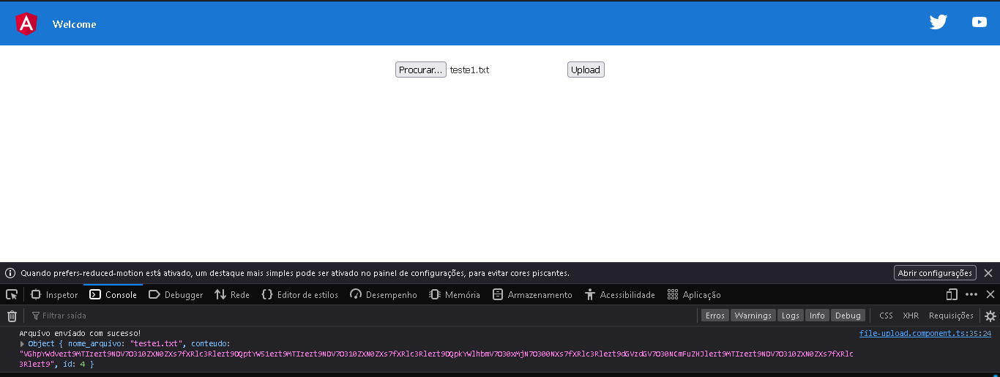
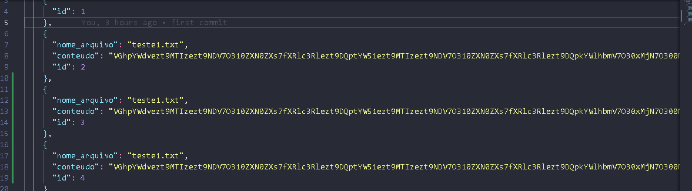

# Iniciar

Precisa ter NoDeJS

## Acessar
Faça o git clone 
Rode

acesse via prompt cmd `cd poc-upload`
instale `npm install`
Rode `ng serve` for a dev server. digite no site `http://localhost:4200/`. 

* Protótipo

## Simular o backend

no prompt de comando
instalar o mock de api
`npm install -g json-server`

na pasta do projeto angular rode 
`json-server --watch db.json`

* Mock Backend Como o Front Envia para o backend

